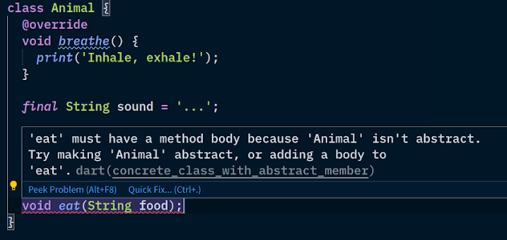
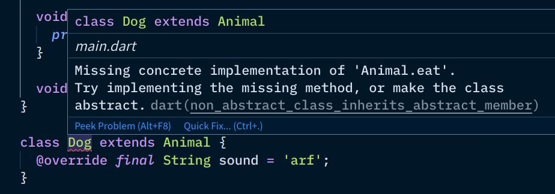
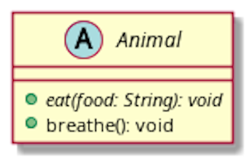

Advanced Polymorphism
----------------------


### Useless superclasses?

Have you noticed that in some cases usually don't instantiate superclasses?

```dart [1-10 | 12-17 | 19-25 | 27-39 | 41-44 | 47 | 50-62]
class Animal {
  void breathe() {
    print('Inhale, exhale!');
  }

  @override
  String toString() { // where did this method come from?
    return this.runtimeType.toString();
  }
}

class Dog extends Animal {
  @override
  void breathe() {
    print('Water breathing, 10th form...');
  }
}

class Cat extends Animal {
  @override
  void breathe() {
    super.breathe();
    print("I'll enslave ol hoomans!");
  }
}

class Bird extends Animal {
  bool flying;

  Bird(this.flying) {}

  @override
  void breathe() {
    if (flying) {
      print("The air iz so thin, but sowat? Imma bird!");
    } else {
      super.breathe();
    }
  }

  @override
  String toString() {
    return "Bird: ${flying ? 'on air' : 'on land'}";
  }
}

class Snake extends Animal {}

void main() {
  var creatures = [
    Bird(true),
    Dog(),
    Bird(false),
    Cat(),
    Snake(),
  ];

  for (final creature in creatures) {
    print('-' * 40);
    print('Animal currently breathing is a $creature');
    creature.breathe();
  }
}
```


### Let's have some `Animal` instances

```dart [6,8]
var creatures = [
  Bird(true),
  Dog(),
  Bird(false),
  Cat(),
  Animal(),
  Snake(),
  Animal()
];
```

* Does it make sense?
  - how does a dog eat? how does a dog look like?
  - how does a cat eat? how does a cat look like?
  - how does an animal eat? how does it look like?
* last question is more difficult to answer


### What kind of object is instantiated with `final animal = Animal()`?

 <!-- .element class="fragment" -->
 <!-- .element class="fragment" -->


### Experiences with Problem Set <span style="text-transform: none">02a</span>

* Which of these classes did you instantiate?
  - the non-cheat die
  - the Employee class
  - the DessertMold class
  - the CarRental class
  - the Vegetable class
* What code did you place for 
  - Employee's salary?
  - DessertMold's volume?
  - CarRental's price?
  - Vegetable's attack?


### Abstract and concrete classes

* **Abstract classes** are too generic, and is often used as a basis for other classes
  - purpose is for code reuse
  - they **cannot** be instantiated
  - if they contain _abstract methods_, they should be abstract
    * it acts as a contract / guarantee that all subclasses are capable of a certain behavior
* **Concrete class** are more specific
  - they can be instantiated
  - should ~~override~~ **implement** all abstract methods
    + although most languages use the `@override` annotation still


### I don't know how an `Animal` eats



<div style="display: flex">
  <ul style="flex: 1">
    <li>
      Abstract methods have no body 👉
      <ul>
        <li>not even an empty block `{}`</li>
        <li>Must mark the class abstract (see previous slide)</li>
      </ul>
    </li>
  </ul>
  
</div>


### When I create a `Dog`, it won't know how to eat



Concrete classes must implement abstract methods


### No more errors, let's code

```dart [1-7 | 9-14 | 16-21 | 23-28]
abstract class Animal {
  void eat(String food);

  void breathe() {
    print("Inhale, exhale!");
  }
}

class Dog extends Animal {
  @override
  void eat(String food) {
    print("Eating $food while wagging tail.");
  }
}

class Cat extends Animal {
  @override
  void eat(String food) {
    print("My hooman slave fed me $food again.");
  }
}

// main.dart
final animal = Animal(); // ERROR, can't instantiate
var cutie = Dog();
cutie.eat('chimken');
cutie = Cat();
cutie.eat('toona');
```

Now we're protected from doing something senseless like instantiating `Animal`s.


### UML notation for abstract

* Abstract class names are italicized
* Abstract methods are also italicized
* Do your best to italicize your handwriting if not using tools 😁

