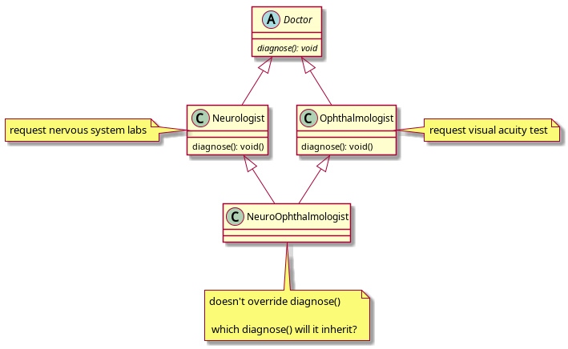
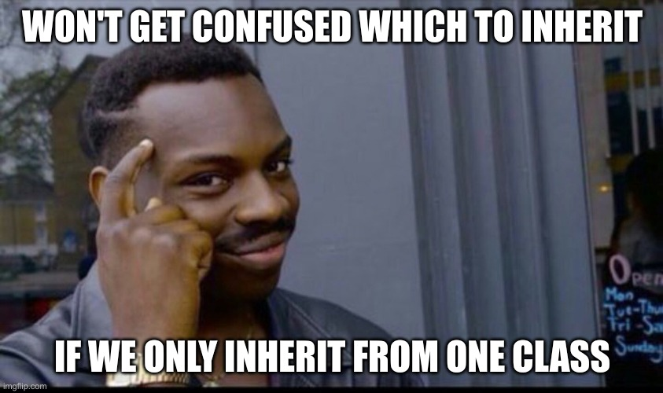
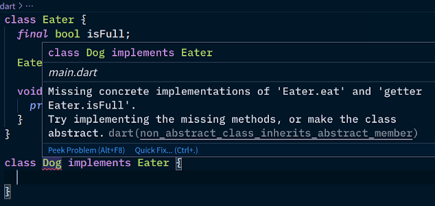

Advanced Polymorphism
----------------------


### Useless superclasses?

Have you noticed that in some cases usually don't instantiate superclasses?

```dart [1-10 | 12-17 | 19-25 | 27-39 | 41-44 | 47 | 50-62]
class Animal {
  void breathe() {
    print('Inhale, exhale!');
  }

  @override
  String toString() { // where did this method come from?
    return this.runtimeType.toString();
  }
}

class Dog extends Animal {
  @override
  void breathe() {
    print('Water breathing, 10th form...');
  }
}

class Cat extends Animal {
  @override
  void breathe() {
    super.breathe();
    print("I'll enslave ol hoomans!");
  }
}

class Bird extends Animal {
  bool flying;

  Bird(this.flying) {}

  @override
  void breathe() {
    if (flying) {
      print("The air iz so thin, but sowat? Imma bird!");
    } else {
      super.breathe();
    }
  }

  @override
  String toString() {
    return "Bird: ${flying ? 'on air' : 'on land'}";
  }
}

class Snake extends Animal {}

void main() {
  var creatures = [
    Bird(true),
    Dog(),
    Bird(false),
    Cat(),
    Snake(),
  ];

  for (final creature in creatures) {
    print('-' * 40);
    print('Animal currently breathing is a $creature');
    creature.breathe();
  }
}
```


### Let's have some `Animal` instances

```dart [6,8]
var creatures = [
  Bird(true),
  Dog(),
  Bird(false),
  Cat(),
  Animal(),
  Snake(),
  Animal()
];
```

* Does it make sense?
  - how does a dog eat? how does a dog look like?
  - how does a cat eat? how does a cat look like?
  - how does an animal eat? how does it look like?
* last question is more difficult to answer


### What kind of object is instantiated with `final animal = Animal()`?

 <!-- .element class="fragment" -->
 <!-- .element class="fragment" -->


### Experiences with Problem Set <span style="text-transform: none">02a</span>

* Which of these classes did you instantiate?
  - the non-cheat die
  - the Employee class
  - the DessertMold class
  - the CarRental class
  - the Vegetable class
* What code did you place for 
  - Employee's salary?
  - DessertMold's volume?
  - CarRental's price?
  - Vegetable's attack?


### Abstract and concrete classes

* **Abstract classes** are too generic, and is often used as a basis for other classes
  - purpose is for code reuse
  - they **cannot** be instantiated
  - if they contain _abstract methods_, they should be abstract
    * it acts as a contract / guarantee that all subclasses are capable of a certain behavior
* **Concrete class** are more specific
  - they can be instantiated
  - should ~~override~~ **implement** all abstract methods
    + although most languages use the `@override` annotation still


### I don't know how an `Animal` eats


<div style="display: flex">
  <ul style="flex: 1">
    <li>
      Abstract methods have no body 👉
      <ul>
        <li>not even an empty block `{}`</li>
        <li>Must mark the class abstract (see previous slide)</li>
      </ul>
    </li>
  </ul>
  
</div>


### When I create a `Dog`, it won't know how to eat


Concrete classes must implement abstract methods


### No more errors, let's code

```dart [1-7 | 9-14 | 16-21 | 23-28]
abstract class Animal {
  void eat(String food);

  void breathe() {
    print("Inhale, exhale!");
  }
}

class Dog extends Animal {
  @override
  void eat(String food) {
    print("Eating $food while wagging tail.");
  }
}

class Cat extends Animal {
  @override
  void eat(String food) {
    print("My hooman slave fed me $food again.");
  }
}

// main.dart
final animal = Animal(); // ERROR, can't instantiate
var cutie = Dog();
cutie.eat('chimken');
cutie = Cat();
cutie.eat('toona');
```

Now we're protected from doing something senseless like instantiating `Animal`s.


### UML notation for abstract

* Abstract class names are italicized
* Abstract methods are also italicized
* Do your best to italicize your handwriting if not using tools 😁


### Interfaces

* An interface is a contract / shape / class design
  - it's a 100% abstract class
  - classes can only extend one superclass, but implement multiple interfaces
  - Dart's interface system is a little unique, but same principle
    + most other strongly-typed languages have an `interface` keyword for this
    + But in Dart, a class can become an interface when the `implements` keyword is used
    + All methods and properties become abstract
  - Solves the Deadly Diamond of Death problem


### Deadly Diamond of Death (1/2)

* possible in languages that allow multiple inheritance (e.g. C++) <!-- .element style="font-size: 0.75em" -->
* class diagram looks like a diamond <!-- .element style="font-size: 0.75em" -->




### Deadly Diamond of Death (2/2)




### Interfaces are 100% abstract classes

* Again, all methods and properties become abstract
  * All classes ~~canbecome~~ are also interfaces in Dart, just use `implements`, and not `extends`
* Classes implementing interfaces **inherit nothing**
  - since they're 100% abstract, there's no code to _"copy"_
* If `Neurologist` and `Ophthalmologist` had abstract `diagnose()` methods
  - `NeuroOphthalmologist` will have to provide an implementation


#### `implements` erases method bodies (1/2)

```dart
class Eater {
  final bool isFull;

  void eat(String food) {
    print("I dunno, start chewing $food?");
  }
}
```




#### `implements` erases method bodies (2/2)

* How `class Dog implements Eater` seems like: <!-- .element style="font-size: 0.95em" -->
  - `Eater` was _kinda converted_ into a 100% abstract class
  - when `Dog` extends it, it has to `@override` **EVERYTHING**


### What `implements` looks like

```dart [1-8 | 10-20]
abstract class Eater {
  // there was no `get` keyword in the original Eater class
  final bool get isFull; ///////// NOW AN ABSTRACT GETTER

  void eat(String food); /* {
    print("I dunno, start chewing $food?");
  } */ ///////// I ERASE YOU
}

class Dog extends Eater {
  // isFull is abstract, must @override
  @override final isFull;

  Dog(this.isFull) {}

  // eat is abstract, must @override
  @override void eat(String food) {
    print('ah teh nOmz! yummy $food');
  }
}
```


### Removing the disguise

```dart [1-9 | 11-19 | 21-28]
class Eater {
  final bool isFull;

  Eater(this.isFull) {} // needed, isFull is final

  void eat(String food) {
    print("I dunno man, chew the $food?");
  }
}

class Dog implements Eater {
  @override final isFull;

  Dog(this.isFull) {}

  @override void eat(String food) {
    print('ah teh nOmz! yummy $food');
  }
}

void main() {
  var eater = Eater(false);
  print(eater.isFull);
  eater.eat('apple');
  eater = Dog(true);
  print(eater.isFull);
  eater.eat('chimken');
}
```

<pre class="fragment">
false
I dunno man, chew the apple?
true
ah teh nOmz! yummy chimken
</pre>