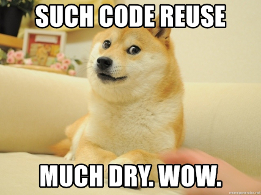
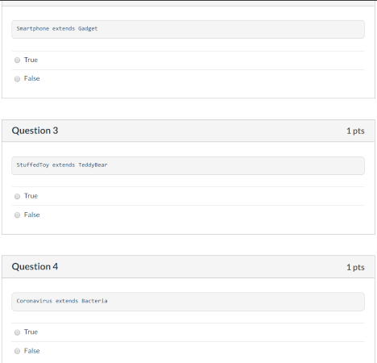
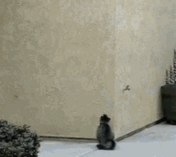
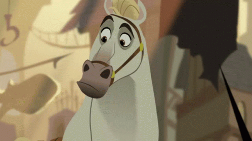
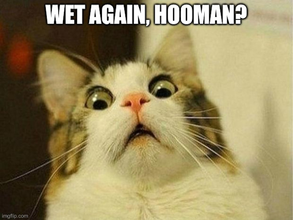
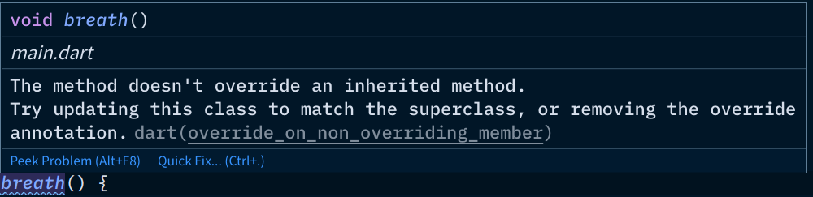

Inheritance
-----------


### Let's refactor using inheritance

```dart [1-5 | 7-9 | 11-13 | 15-17 | 19-25]
class Animal {
  void breathe() {
    print('Inhale exhale!');
  }
}

class Dog extends Animal {

}

class Cat extends Animal {

}

class Horse extends Animal {

}

// main.dart
final dog = Dog();
final cat = Cat();
final horse = Horse();
dog.breathe();
cat.breathe();
horse.breathe();
```

Dog, Cat, and Horse copied (**inherited**) the `breathe` method from Animal!


### corgo iz much pleasd



Inheritance allows us to reuse code from another class, and stay DRY.


### Terminologies

* __Inheritance__ is the mechanism of basing a class upon another class, _retaining similar 
  implementation_. 
  - one of the three pillars of OOP
* Animal is a **superclass**
  - base class or parent class in some languages/books
  - you can also tell by the _keyword_ they're using
    + C# `base`
    + PHP `parent`
* Dog, Cat, and Horse are **subclass**es
  - a.k.a. derived class, child class


### Should you inherit if the implementation is the same?

```dart
class Ventilator extends Animal {

}

// main.dart
final vent = Ventilator();
vent.breathe();
```

A Ventilator extends an animal('s life)?

Ventilator extends Animal!  Genius!

Don't rely on the `extends` keyword.  Use the _is-a_ test


### The _is-a_ test (1/3)

If it makes sense, then proceed with `extends`

* a dog **is a**n animal <span style="color: green">✔</span>
  - `class Dog extends Animal`
* a cat **is a**n animal <span style="color: green">✔</span>
  - `class Cat extends Animal`
* a horse **is a**n animal <span style="color: green">✔</span>
  - `class Horse extends Animal`
* a ventilator **is a**n animal <span style="color: red">❌</span>


### The _is-a_ test (2/3)

Some might be _has-a_ relationships, _has-a_ **is not** _is-a_
has-a (composition) will be the next next topic

* `class House extends Roof` // hhmmm?
  - a house **is a** roof <small style="color: red">sounds wrong</small>
  - a house **has a** roof <small style="color: blue">definitely not inheritance</small>
* `class Leash extends Dog` // maybe?
  - a leash **is a** dog <small style="color: red">sounds wrong</small>
  - a leash **has a** dog <small style="color: blue">definitely not inheritance</small>
* `class Biologist extends Scientist`
  - a biologist **is a** scientist <span style="color: green">✔</span>


### The _is-a_ test (3/3)

Roses are red, violets are blue.
Mango is a fruit, but the reverse ain't true.

* `class Animal extends Dog`
  - an animal **is a** dog <span style="color: red">❌</span>
* `class Dog extends Animal`
  - a dog **is a**n animal <span style="color: green">✔</span>
* inheritance is one-way only.
  - an instrument **is a** guitar <span style="color: red">❌</span>
  - a guitar **is a**n instrument <span style="color: green">✔</span>


### Your turn (1/2)

Take the quiz [here](https://canvas.instructure.com/courses/2109863/quizzes/5578645).
Answer true if the inheritance is OK.




### Your turn (2/2)

* Name 2 possible subclasses for each of these:
  - do it on [this Canvas discussion](https://psse-cpu.github.io/se-1223-inheritance-slides/#/2/9)
    + musical instrument
    + house
    + doctor
    + illness
    + shape
    + pasta
    + weapon
    + sin
    + spell effect
    + transaction _(ooof that's a hard one)_ <!-- .element class="fragment" -->
  


### The the _is-a_ test perfect?

* Nope, it usually works 99% of the time.  Sometimes it won't work if the subclass has an incompatible
  behavior with the superclass.  The classical example:
  + Square-rectangle problem
  + a.k.a. Circle-ellipse problem

* There's a S.O.L.I.D. principle that you'll study independently, called the:
  _Liskov Substitution Principle_ (LSP).


### Cats climb and have up to 9 lives

```dart
class Cat extends Animal {
  int _lives;

  set lives(int lives) {
    _lives = species == 'cat' ? lives : 1;
  }
  int get lives => _lives;

  void climb() {
    print("Reach for the stars!!!");
  }
}
```

**AND** no need to check if species is cat.

```dart
if (species != 'cat') {
  print('Aaayyyiiiieee na fall ♥');
}
```


### ONLY cats climb and have many lives

```dart
final doggo = Dog();
doggo.climb(); // syntax error
doggo.lives = 2; // immmmortalitttyyyy, aw syntax error
doggo.breathe(); // am bord of only breathin'

final cat = Cat();
cat.climb(); // OK
cat.lives = 7; // lost the other 2 from skydiving
cat.breathe(); // yup that won't disappear
```




### Don't horses breathe differently?



```dart
class Horse extends Animal {
  void breathe() => print('Yi fufufufufu');
}

// main.dart
Dog().breathe(); // Inhale, exhale!
Horse().breathe(); // Yi fufufufufu
```


### Method overriding

Method overriding, in object-oriented programming, is a language feature that allows a subclass or 
to provide a specific implementation of a method that is already provided by its superclass.

* it can be totally different
  - Inhale, exhale!
  - Yi fufufufufu
* it can be similar with minor additions
  - _(almost)_ all animals jump
  - but cats always land on their feet


### Cats always land on their feet, dogs don't do well beyond 7 feet

```dart [1-5 | 7-12 | 14-22 | 24-29]
class Animal {
  void jump(int height) {
    print('Launching body $height ft. into the air...');
  }
}

class Cat extends Animal {
  void jump(int height) {
    print('Launching body $height ft. into the air...');
    print("And he/she sticks the landing!");
  }
}

class Dog extends Animal {
  void jump(int height) {
    print('Launching body $height ft. into the air...');
    
    if (height >= 7) {
      print("I think i broke mai bonez 😢");
    }
  } 
}

// main.dart
final doggo = Dog();
doggo.jump(35); // an OK jump
doggo.jump(51); // too high, doge bonez broke
horse.jump(100); // inherited from Animal
cat.jump(999); // always lands on 2 feet
```

Are we all good? <!-- .element class="fragment" -->


### Copy-pasting `breathe()` from Animal isn't such a good idea




### Staying DRY

```dart [1-5 | 7-14 | 16-24 | 9 | 18]
class Animal {
  void jump(int height) {
    print('Launching body $height ft. into the air...');
  }
}

class Cat extends Animal {
  void jump(int height) {
    super.jump(height); // copy jump from superclass

    // and add some extra logic
    print("And he/she sticks the landing!");
  }
}

class Dog extends Animal {
  void jump(int height) {
    super.jump(height); // copy jump from superclass
    
    if (height >= 7) { // extra logic
      print("I think i broke mai bonez 😢");
    }
  } 
}
```

<span class="fragment">
  What happens if we forget the <code>super</code> keyword, and just write <code>jump(height)</code>
  on lines 9 and 18?
</span>


### Careful to avoid infinite recursion

It's a form of infinite loop


### Doge wants to breathe uniquely

```dart
class Dog extends Animal {
  void breath() { // note it's misspelled
    print("Water breathing...10th form: Constant Flux");
  }
}

// main.dart
final dog = Dog();
dog.breathe(); // NOT misspelled
```

Output:

```text
Inhale, exhale!
```

We accidentally created another method on Dog called `breath`, that's not an override!


### Guaranteeing overrides (1/2)

```dart
class Dog extends Animal {
  @override
  void breath() { // note it's misspelled
    print("Water breathing...10th form: Constant Flux");
  }
}
```

This code will run, but you'll get a linter warning.




### Guaranteeing overrides (2/2)

```dart
class Dog extends Animal {
  @override
  void breathe() { // NO LONGER MISSPELLED!
    print("Water breathing...10th form: Constant Flux");
  }
}

// main.dart
final dog = Dog();
dog.breathe();
```

<div style="display: flex; align-items: center;">
  
  <span style="flex: 1; padding: 16px; text-align: left; font-size: 0.85em;">
    Output: <br><br>
    Water breathing...10th form: Constant Flux
  </pre>
</div>
