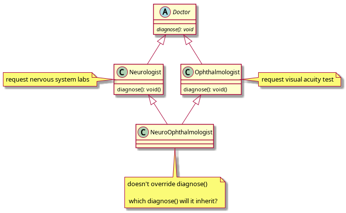
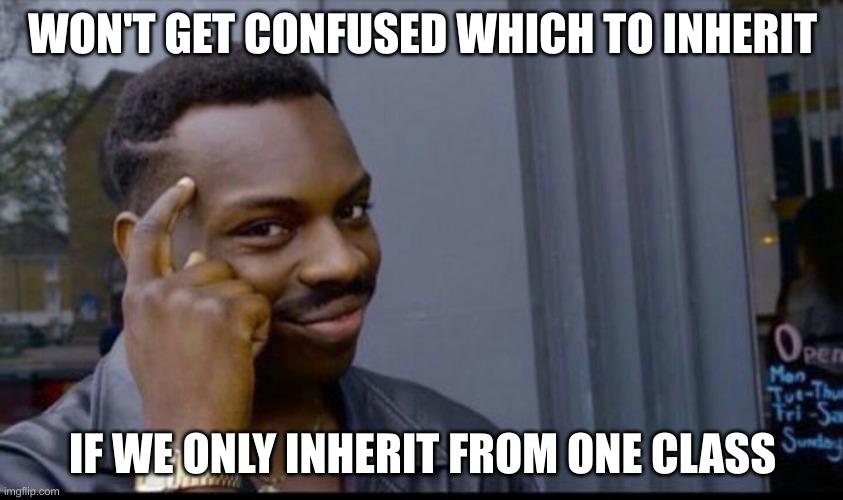
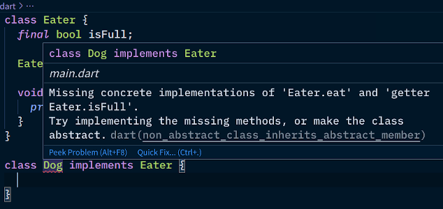
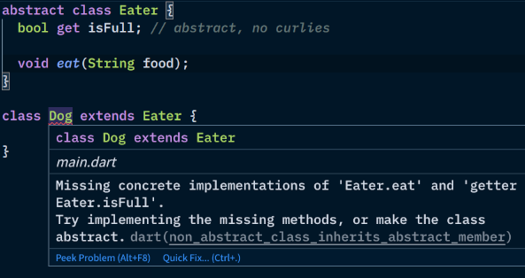

Interfaces
----------


### Interfaces

* An interface is a contract / shape / class design
  - it's a 100% abstract class
  - classes can only extend one superclass, but implement multiple interfaces
  - Dart's interface system is a little unique, but same principle
    + most other strongly-typed languages have an `interface` keyword for this
    + But in Dart, a class can become an interface when the `implements` keyword is used
    + All methods and properties become abstract
  - Solves the Deadly Diamond of Death problem


### Deadly Diamond of Death (1/2)

* possible in languages that allow multiple inheritance (e.g. C++) <!-- .element style="font-size: 0.75em" -->
* class diagram looks like a diamond <!-- .element style="font-size: 0.75em" -->




### Deadly Diamond of Death (2/2)




### Interfaces are 100% abstract classes

* Again, all methods and properties become abstract
  * All classes ~~canbecome~~ are also interfaces in Dart, just use `implements`, and not `extends`
* Classes implementing interfaces **inherit nothing**
  - since they're 100% abstract, there's no code to _"copy"_
* If `Neurologist` and `Ophthalmologist` had abstract `diagnose()` methods
  - `NeuroOphthalmologist` will have to provide an implementation


#### `implements` erases method bodies (1/2)

```dart
class Eater {
  final bool isFull;

  void eat(String food) {
    print("I dunno, start chewing $food?");
  }
}
```




#### `implements` erases method bodies (2/2)

* How `class Dog implements Eater` seems like: <!-- .element style="font-size: 0.95em" -->
  - `Eater` was _kinda converted_ into a 100% abstract class
  - when `Dog` extends it, it has to `@override` **EVERYTHING**




### What `implements` looks like

```dart [1-8 | 10-20]
abstract class Eater {
  // there was no `get` keyword in the original Eater class
  final bool get isFull; ///////// NOW AN ABSTRACT GETTER

  void eat(String food); /* {
    print("I dunno, start chewing $food?");
  } */ ///////// I ERASE YOU
}

class Dog extends Eater {
  // isFull is abstract, must @override
  @override final isFull;

  Dog(this.isFull) {}

  // eat is abstract, must @override
  @override void eat(String food) {
    print('ah teh nOmz! yummy $food');
  }
}
```

This is just an approximation.


### Removing the disguise

```dart [1-9 | 11-19 | 21-28]
class Eater {
  final bool isFull;

  Eater(this.isFull) {} // needed, isFull is final

  void eat(String food) {
    print("I dunno man, chew the $food?");
  }
}

class Dog implements Eater {
  @override final isFull;

  Dog(this.isFull) {}

  @override void eat(String food) {
    print('ah teh nOmz! yummy $food');
  }
}

void main() {
  var eater = Eater(false);
  print(eater.isFull);
  eater.eat('apple');
  eater = Dog(true);
  print(eater.isFull);
  eater.eat('chimken');
}
```

<pre class="fragment">
false
I dunno man, chew the apple?
true
ah teh nOmz! yummy chimken
</pre>