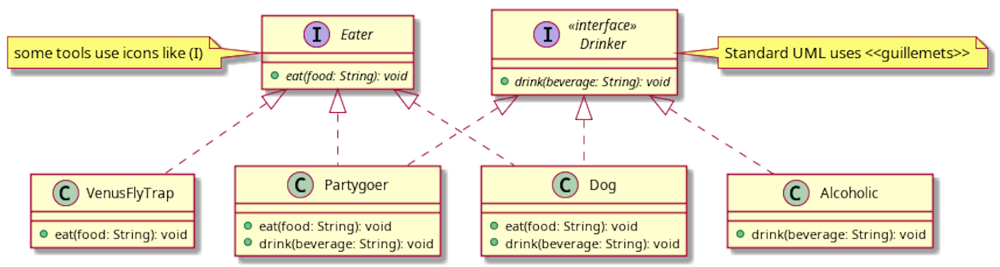
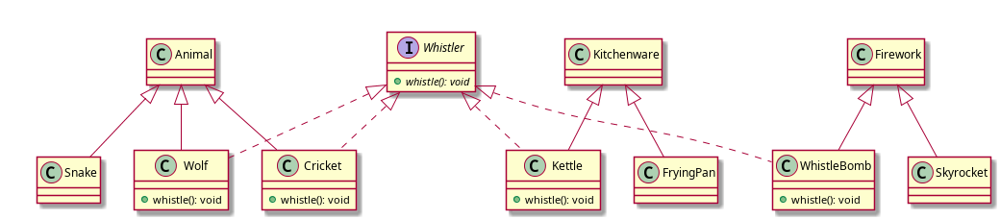

Interfaces
----------


### Interfaces

* An interface is a contract / shape / class design
  - it's a 100% abstract class
  - classes can only extend one superclass, but implement multiple interfaces
  - Dart's interface system is a little unique, but same principle
    + most other strongly-typed languages have an `interface` keyword for this
    + But w/ Dart's [implicit interfaces](https://dart.dev/guides/language/language-tour#implicit-interfaces),
    any class can become an interface when the `implements` keyword is used
    + All methods and properties become abstract
  - Solves the Deadly Diamond of Death problem


### Deadly Diamond of Death (1/2)

* possible in languages that allow multiple inheritance (e.g. C++) <!-- .element style="font-size: 0.75em" -->
* class diagram looks like a diamond <!-- .element style="font-size: 0.75em" -->


### Deadly Diamond of Death (2/2)


### Interfaces are 100% abstract classes

* Again, all methods and properties become abstract
  * All classes ~~canbecome~~ are also interfaces in Dart, just use `implements`, and not `extends`
* Classes implementing interfaces **inherit nothing**
  - since they're 100% abstract, there's no code to _"copy"_
* If `Neurologist` and `Ophthalmologist` had abstract `diagnose()` methods
  - `NeuroOphthalmologist` will have to provide an implementation


#### `implements` erases method bodies (1/2)

```dart
class Eater {
  final bool isFull;

  void eat(String food) {
    print("I dunno, start chewing $food?");
  }
}
```


#### `implements` erases method bodies (2/2)

* How `class Dog implements Eater` seems like: <!-- .element style="font-size: 0.95em" -->
  - `Eater` was _kinda converted_ into a 100% abstract class
  - when `Dog` extends it, it has to `@override` **EVERYTHING**


### What `implements` looks like

```dart [1-8 | 10-20]
abstract class Eater {
  // there was no `get` keyword in the original Eater class
  final bool get isFull; ///////// NOW AN ABSTRACT GETTER

  void eat(String food); /* {
    print("I dunno, start chewing $food?");
  } */ ///////// I ERASE YOU
}

class Dog extends Eater {
  // isFull is abstract, must @override
  @override final isFull;

  Dog(this.isFull) {}

  // eat is abstract, must @override
  @override void eat(String food) {
    print('ah teh nOmz! yummy $food');
  }
}
```

This is just an approximation.


### Removing the disguise

```dart [1-9 | 11-19 | 21-28]
class Eater {
  final bool isFull;

  Eater(this.isFull) {} // needed, isFull is final

  void eat(String food) {
    print("I dunno man, chew the $food?");
  }
}

class Dog implements Eater {
  @override final isFull;

  Dog(this.isFull) {}

  @override void eat(String food) {
    print('ah teh nOmz! yummy $food');
  }
}

void main() {
  var eater = Eater(false);
  print(eater.isFull);
  eater.eat('apple');
  eater = Dog(true);
  print(eater.isFull);
  eater.eat('chimken');
}
```

<pre class="fragment">
false
I dunno man, chew the apple?
true
ah teh nOmz! yummy chimken
</pre>


### We don't usually do this though

* Create a 100% abstract class if you intend it to be an interface.
* Take a look at an interface we will learn later, [`Comparable`](https://github.com/dart-lang/sdk/blob/caebd6700d5ece73b5566b33ff1daecb91dac500/sdk/lib/core/comparable.dart)
  - Do you see any methods with a body?
* Or a data structure you will encounter (or might have already encountered)
  [Map](https://github.com/dart-lang/sdk/blob/caebd6700d5ece73b5566b33ff1daecb91dac500/sdk/lib/core/map.dart)
* Interfaces are 100% abstract classes
  - we should (usually) write them that way


### UML for interface



* Note the difference in arrows
  - extends is a solid line
  - implements is a dashed-line


### Abstract classes vs interfaces

* You can Google tons of them
  - BUT some differences only apply to certain languages
    + abstract classes can have `protected` methods in Java, but Dart doesn't have `protected`
    + some languages (like Java again), allow default methods (methods with body) in interfaces
      (I/Fs) <sup style="color: blue">they have rules to avoid DDD</sup>
  - but what's common in most langauges are:
    + can only extend one abstract class, can implement multiple I/Fs
    + abstract classes for **code reuse** (some methods not abstract)
    + interfaces if you want classes to play some role _(can-act-as-a)_
    + interfaces can span multiple inheritance trees


  
### last two bullets, explained in 1 pic



+ three inheritance hierarchies
  - Animal, Kitchenware, Firework
  - Whistler was able to _"penetrate"_ them
  - Wolf, Cricket, Kettle, WhistleBomb _can-act-as-(a)_ whistlers


### Convert diagram into code

```dart [1-3 | 5-17 | 19 | 21-29 | 31-39 | 41-52]
abstract class Whistler {
  void whistle();
}

abstract class Animal {}

class Wolf extends Animal implements Whistler {
  void whistle() {
    print("Aaaawwwwooooo!");
  }
}

class Cricket extends Animal implements Whistler {
  void whistle() {
    print("kroo kroo kroo");
  }
}

class Snake extends Animal {} // can't whistle

abstract class Kitchenware {}

class FryingPan extends Kitchenware {}

class Kettle extends Kitchenware implements Whistler {
  void whistle() {
    print("ppppphhhhheeeewww ang ininit mo!!");
  }
}

abstract class Firework {}

class Skyrocket extends Firework {}

class WhistleBomb extends Firework implements Whistler {
  void whistle() {
    print('wwwwweeeeeyyyyyyuuuu bbboooommmm!');
  }
}

void celebrateNewYear(Whistler noisy) {
  stdout.write("Goodbye 2020 nga daw jowk!  ");
  noisy.whistle();
}

void main() {
  celebrateNewYear(Wolf());
  celebrateNewYear(Cricket());
  celebrateNewYear(Kettle());
  celebrateNewYear(WhistleBomb());
  celebrateNewYear(Snake()); // ❌ Snake is not a Whister
}
```

<pre>
Goodbye 2020 nga daw jowk!  Aaaawwwwooooo!
Goodbye 2020 nga daw jowk!  kroo kroo kroo
Goodbye 2020 nga daw jowk!  ppppphhhhheeeewww ang ininit mo!!
Goodbye 2020 nga daw jowk!  wwwwweeeeeyyyyyyuuuu bbboooommmm!
</pre>