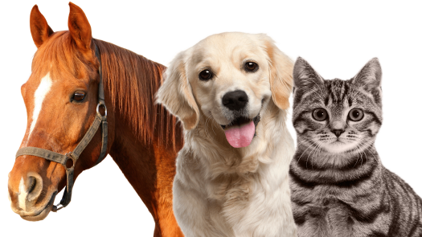

### Outline

* inheritance
  - _is-a_ test
  - _is-a_ vs _has-a_
  - method overriding
  - reusing superclass logic
* polymorphism


### Dogs are getting lonely and bored

 <!-- .element style="width: 480px; height: 480px" -->


### Let's give them other playmates from kingdom animalia



Apparently, playing with other canines lacks fun and diversity 😁 <!-- .element class="fragment" -->


### Let's code, basics first - breathing

```dart [1-5 | 7-11 | 13-17]
class Dog {
  void breathe() {
    print('Inhale, exhale!');
  }
}

class Cat {
  void breathe() {
    print('Inhale, exhale!');
  }
}

class Horse {
  void breathe() {
    print('Inhale, exhale!');
  }
}
```

What do you think? <!-- .element class="fragment" -->


### Here we go again


### Did you ever get punished like this?

```dart
void main() {
  print('I will not repeat my code');
  print('I will not repeat my code');
  print('I will not repeat my code');
  print('I will not repeat my code');
  print('I will not repeat my code');
  print('I will not repeat my code');
  print('I will not repeat my code');
  print('I will not repeat my code');
  print('I will not repeat my code');
  print('I will not repeat my code');
  print('I will not repeat my code');
  print('I will not repeat my code');
}
```

Again, #stayDRY (Don't Repeat Yourself) <!-- .element class="fragment" -->


### They're all animals (the hope)

```dart
class Animal {
  String species;

  Animal(this.species) {}

  void breathe() {
    print('Inhale exhale!');
  }
}

// main.dart
final dog = Animal('dog');
final cat = Animal('cat');
print('Imma genius!');
```

Can you find ways this solution could quickly unravel? <!-- .element class="fragment" -->


### They're all animals (the mess)

```dart  [3-4 | 12-13 | 15-21 | 23-29 | 31-41]
class Animal {
  String species;
  int _lives; // only applies to cats
  bool missesOwner; // always false for horse and cat
  
  Animal(this.species) {}

  void breathe() {
    print('Inhale exhale!');
  }

  set lives(int lives) => _lives = species == 'cat' ? lives : 1;
  int get lives => _lives;

  void kick() {
    if (species == 'horse') {
      print('Nyahaha get outta here!');
    } else {
      print('Kicking is a horse-exclusive ability');
    }
  }
  
  void climb() {
    if (species == 'cat') {
      print("Reach for the stars!!!");
    } else {
      print('Aaayyyiiiieee na fall ♥');
    }
  }

  void jump(int height) {
    print('Launching body into the air...');

    if (height >= 50 && species != 'cat') {
      print("I think I broke my bones 😢");
    }

    if (species == 'cat') {
      print("And he/she sticks the landing!");
    }
  }
}
```

&& that's just 3 kinds of animals <!-- .element class="fragment" -->
