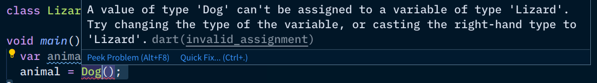
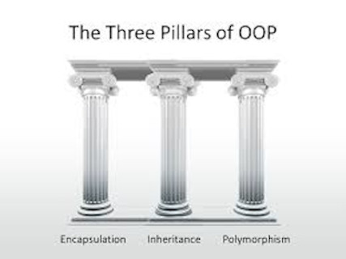

Polymorphism
------------


### Polymorphism

* It is the ability of an object to take on _many forms_, and the most basic form occurs 
  as a result of objects being related through inheritance.
  - Greek **poly** (many) + **morphe** (form)
  - _"There are many forms of animals."_
* It allows a subclass instance to take the place of its superclass' instance.

```dart
Animal animal = Dog();
animal.breathe(); // Water breathing...10th form...
animal = Cat();
animal.breathe(); // Inhale, exhale!
```


### A Lizard is _(not yet)_ an animal

```dart
class Lizard { // forgot to extend Animal
  
}

// main.dart
Animal creature = Lizard(); // error, Lizard IS NOT AN animal
```

Be careful of Dart's type inference

```dart
class Lizard extends Animal {}

var animal = Lizard(); // type is inferred to be Lizard
animal = Dog(); // can't assign Dog to a Lizard variable
```




### Enough breathing, make 'em climb

```dart
Animal cute = Cat();
cute.climb(); // NOT OK
```

 <!-- .element class="fragment" -->


### Not all animals can climb (1/2)

Remember that with polymorphism, subclass instances **can take the place** of its superclass 
instances, ...ANY...TIME...

```dart
Animal cutie = Cat();
cutie.climb(); // EVEN IF Dart allows this to work
// .
// . 300
// . lines
// . later
// .
cutie = Dog(); // with polymorphism, `cute` can become
cutie.climb(); // a non-climbing animal in the future
```


### Not all animals can climb (2/2)

```dart [1-4 | 6-8 | 10-12 | 14-16 | 18-20]
// authored July 17, 2020
class Animal {
  void breathe() { /* ... */ }
}

class Dog extends Animal {
  void climb() { /* ... */ }
}

class Cat extends Animal {
  void climb() { /* ... */ }
}

class Snake extends Animal {
  void climb() { /* ... */ }
}

// main.dart
Animal cutie = Cat();
cutie.climb(); // NOPE still won't work
```

All of our animals can climb, so why still an error?


### Not all _(future)_ animals can climb

```dart
// main.dart
Animal cutie = Cat();
cutie.climb(); // EVEN IF Dart allows this to work

// turtle.dart
// authored December 25, 2021
class Turtle extends Animal {
  // NOPE - no climb method here
  // it's not a guarantee that all animals can climb
}

// main.dart edited in December 25, 2021
cutie = Turtle();
cutie.climb(); // 👈 Dart protects us from these
```

Only methods and properties from the variable's declared type (class) are allowed.


### More capabilities for Animal

```dart [1-5 | 7-9 | 11-13 | 15-18 | 20-30]
class Animal {
  void breathe() { /* ... */ }
  void eat() { /* ... */ }
  void sleep() { /* ... */ }
}

class Lion extends Animal {
  void hunt(Animal prey) { /* ... */}
}

class Rabbit extends Animal {
  void hop() { /* ... */ }
}

// main.dart();
Animal rabbit = Rabbit();
Animal lion = Lion();
var lioness = Lion();

// which of these lines will have an error?
rabbit.hop();
rabbit.breathe();
lion.hunt(rabbit);
lion.eat();
lion.sleep();
lion.breathe();
lioness.hunt(lion);
lioness.eat();
lioness.breathe();
lioness.sleep();
```

Answer and explain in this [Canvas discussion](https://canvas.instructure.com/courses/2109863/discussion_topics/9368020)


### Polymorphism in lists

Polymorphism allows you to loop over objects:

```dart [1-10 | 12-17 | 19-25 | 27-39 | 41-44 | 47 | 50-62]
class Animal {
  void breathe() {
    print('Inhale, exhale!');
  }

  @override
  String toString() { // where did this method come from?
    return this.runtimeType.toString();
  }
}

class Dog extends Animal {
  @override
  void breathe() {
    print('Water breathing, 10th form...');
  }
}

class Cat extends Animal {
  @override
  void breathe() {
    super.breathe();
    print("I'll enslave ol hoomans!");
  }
}

class Bird extends Animal {
  bool flying;

  Bird(this.flying) {}

  @override
  void breathe() {
    if (flying) {
      print("The air iz so thin, but sowat? Imma bird!");
    } else {
      super.breathe();
    }
  }

  @override
  String toString() {
    return "Bird: ${flying ? 'on air' : 'on land'}";
  }
}

class Snake extends Animal {}

void main() {
  var creatures = [ // dart is smart enough to infer
    Bird(true),     // that this is a List&lt;Animal&gt;
    Dog(),
    Bird(false),
    Cat(),
    Snake(),
  ];

  for (final creature in creatures) {
    print('-' * 40);
    print('Animal currently breathing is a $creature');
    creature.breathe();
  }
}
```


### Or other interesting things...

```dart [1-11 | 13-15 | 17-19 | 21-23 | 25-27 | 29-33 | 36-38 | 42-49]
class Animal {
  void breathe() {
    print('Inhale, exhale!');
  }

  final String sound = '...';

  void makeSound({ screaming: false }) {
    print(screaming ? sound.toUpperCase() : sound);
  }
}

class Dog extends Animal {
  @override final String sound = 'arf';
}

class Cat extends Animal {
  @override final String sound = 'meow';
}

class Bird extends Animal {
  @override final String sound = 'tweet';
}

class Snake extends Animal {
  @override final String sound = 'hiss';
}

void vaccinate(Animal animal, String vaccine) {
  print('Injecting $vaccine vaccine to ' +
        animal.runtimeType.toString());
  animal.makeSound(screaming: true);
}

void main() {
  vaccinate(Dog(), 'anti-rabies');
  vaccinate(Cat(), 'anti-rabies');
  vaccinate(Bird(), 'bird flu');
}

/*
OUTPUT:

Injecting anti-rabies vaccine to Dog
ARF
Injecting anti-rabies vaccine to Cat
MEOW
Injecting bird flu vaccine to Bird
TWEET
*/
```

Yes overriding is not limited to methods in some languages.  We can also override properties. <!-- .element class="fragment" -->


### And that's the glimpse of the 3 pillars of OOP



Next topic is the rightmost pillar on steroids! 😁