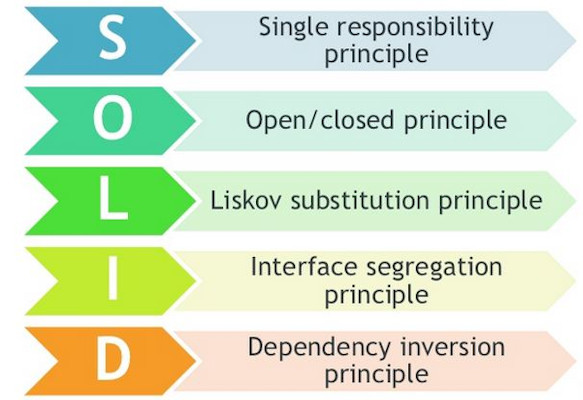

OOP Principles, Again
---------------------

### Why bother with polymorphism?

+ Polymorphism means many forms:
  - many forms of login
    * username, password
    * login with FB, Twitter, Google
    * fingerprint login (e.g. banking apps)
    * magic link login (e.g. Slack)
    * other future ways to login we haven't discovered
  - many forms of payment
    * COD
    * credit / debit cards
    * ShopeePay, Shopee Coins
    * GCash, Paymaya, GrabPay
    * other future ways to pay we haven't discovered

### v3.0.2 patch notes: nerfed invoker

Two enemies of software engg: complexity and change

### Open-closed Principle (1/2)

We've discussed the first one last topic: SRP

### Open-closed Principle (2/2)

<!-- avoiding 4-space indents -->

<ul>
<li>
  Classes should be open for extension...
  <ul><li>
  there are many techniques such as polymorphism that will allow us to add functionality
  </li></ul>
</li>
<li>
  but closed for modification.
  <ul><li>
  we've spent a lot of time making this class bug-free, you can't modify this
  </li><li>
  add your feature in another class, without modifying existing classes
  </li></ul>
</li>
</ul>

### Program to an interface, not an implementation

* The word `interface` here does not mean Dart or Java interfaces
  - It was phrased when C++ was still the goto OOP language
    + it doesn't have an `interface` keyword either
* interface means supertype, and supertype means:
  - abstract classes, or
  - interfaces
* Program to a supertype, not a subtype

### What if `celebrateNewYear` only worked with `Whistlebomb`?

* What if Pres. Du√900 bans whistlebombs?
  - `celebrateNewYear(WhistleBomb whistler)`
    + is very limiting
    + WhistleBomb is not a supertype
    + it only works with instances WhistleBomb and its subclasses
  - `celebrateNewYear(Firework firework)`
    + is more flexible
    + Firework is a supertype (abstract class)
    + it works with any kind of fireworks, including Skyrockets, Sparklers, and any other firework
      in the future

### What if `celebrateNewYear` only worked with a Whistlebomb?

* Anticipating that Pres. Du√900 bans **ALL** fireworks?
  - `celebrateNewYear(Whistler whistler)`
    + also flexible, but different results
    + Whistler is a supertype (interface)
    + it works with all kinds of whistlers:  wolves, crickets, kettles
    + **future** whistlers from other inheritance trees you have not discovered yet:
      - trumpets and saxophones from the musical instruments inheritance tree
      - jolly people, dog owners, ~~catcallers~~ (R.A. 11313: Bawal Bastos Law)
      - the wind during a typhoon

### Exercise

* Think of anything else that can whistle, make it implement whistler, and use it to celebrate 2021.
* It doesn't even have to be in an inheritance hierarchy, a simple class that doesn't inherit from
  anything would do.
* Don't use my examples above. 😈😈😈
  - unless your creative juices have ran out
* Share about it in this [Canvas discussion](https://canvas.instructure.com/courses/2109863/discussion_topics/9381740).
