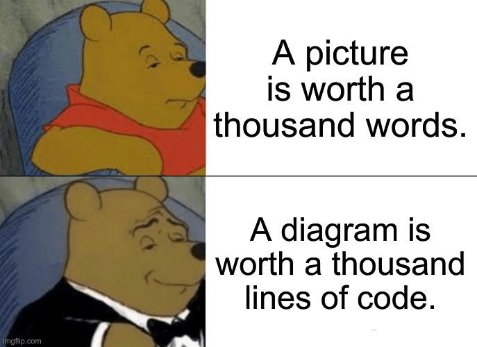
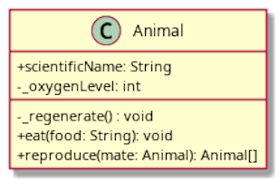
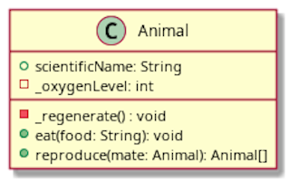
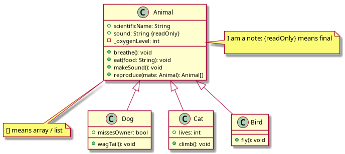

Unified Modelling Language
--------------------------

### Visualizing code structure without code

The next section and next topic is going to have more and more classes, and each class has tons of
lines of code inside.

* What if I only want to know the classes':
  - instance variables
  - methods
  - visibility of members
  - relationships (is-a, has-a)

### As the old quote goes...

### Unified Modelling Language (UML)

* The Unified Modeling Language (UML) is a general-purpose, developmental, modeling language in the 
  field of software engineering that is intended to provide a 
  **[standard](https://www.iso.org/standard/32624.html) way to visualize the design** of a system 
  (-Wikipedia)
  - Design means the software's internal structure that will serve as the basis for its construction
    (coding) -[SWEBOK](http://swebokwiki.org/Chapter_2:_Software_Design)
    + _how did you structure (design) your petshop system?  What classes?  Did you use inheritance 
      for the pets?  Or just one pet class and no subclasses?  What methods?_
  - it does not refer to UI design

### The Three Amigos created UML

### Class Diagram

+ Classes are a 3-layer box
  * visibility (public is +, private is -)
    - some UML tools (e.g. PlantUML) may use icons
  * first layer is class name
  * second layer are instance vars
  * third layer are methods

### What to use to draw UML?

* pen and paper
* marker and whiteboard
* Drag and drop tools, both free and paid
* text-based tools, like PlantUML
  - Git-friendly
  - no manual layout
  - recommended, it's what I use for the slides
* **I don't care what you use**, make sure it's:
  - legally-acquired
  - doesn't get in your way

### How about inheritance?

- _extends_ is a solid line w/ hollow triangle arrowhead
- folded paper are notes/comments